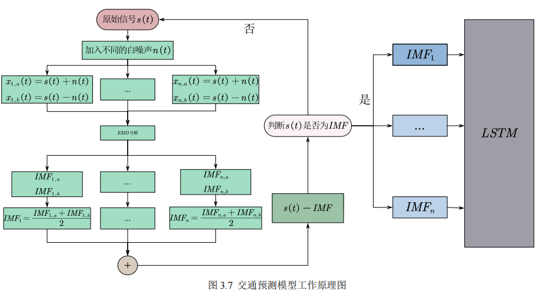
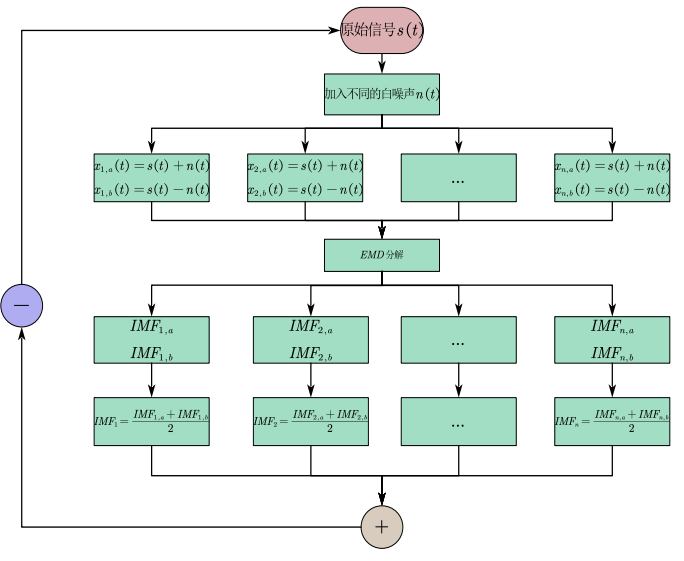
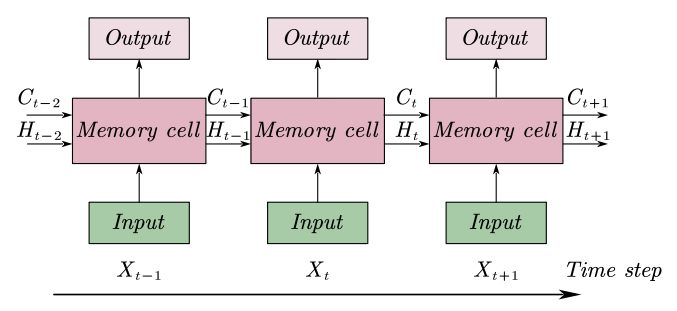
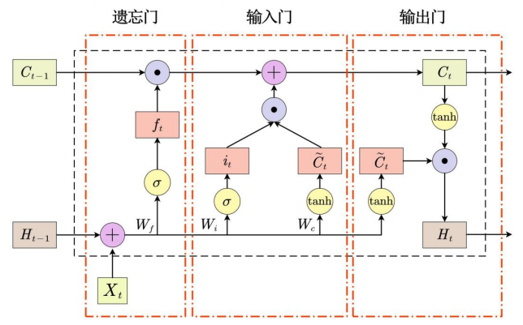
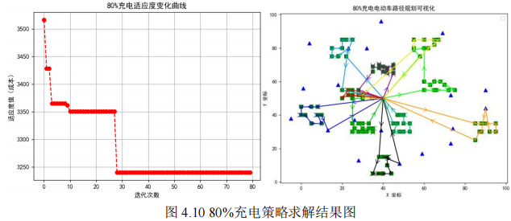

# EVRP Optimization with Dynamic Traffic Flow

This repository contains the implementation for my undergraduate thesis: **"Research on Electric Vehicle Routing Problem (EVRP) Considering Traffic Flow Influence"**.

The project proposes a hybrid framework integrating **Deep Learning** (CEEMDAN-LSTM) and **Heuristic Optimization** (Improved Genetic Algorithm) to solve logistics routing problems under dynamic traffic constraints.

## 📂 Directory Structure Overview

### 1. `undergraduate_thesis.pdf`
The full text of the undergraduate thesis (Language: Chinese).
* **Title**: *Research on Electric Vehicle Charging Logistics Distribution Route Planning Considering Traffic Flow Influence*.
* **Content**: Detailed documentation of the mathematical modeling, **CEEMDAN-LSTM** traffic prediction framework, **Improved Genetic Algorithm** design, and comprehensive experimental analysis.

### 2. `CEEMDAN_LSTM`
This directory contains the **Traffic Flow Prediction Module** implemented in **PyTorch**.
* **Core Logic**: Implements a hybrid deep learning framework that first decomposes non-stationary traffic data using **CEEMDAN** (Complete Ensemble Empirical Mode Decomposition with Adaptive Noise) and then predicts each component using **LSTM** networks.
* **Function**: Generates dynamic travel speed curves to replace traditional static speed assumptions in the routing model.

### 3. `MY_GA`
This directory houses the **EVRP Optimization Solver** built with an **Improved Genetic Algorithm**.
* **Algorithm**: Features a custom GA with **Elite Preservation** strategies and **Heuristic Initialization** (Nearest Neighbor) to prevent premature convergence.
* **Models**: Includes specific cost functions for electric vehicles, accounting for **speed-dependent energy consumption**, **soft time-window penalties**, and dynamic **charging/swapping strategies**.

## 🧠 Core Methodology

### 1. Traffic Prediction (CEEMDAN-LSTM)
The framework utilizes a hybrid Deep Learning model to handle non-stationary traffic data.

  
   
  <em>Figure 1: Workflow of the CEEMDAN-LSTM Traffic Prediction Model</em>

* **Decomposition**: Utilized **CEEMDAN** (Complete Ensemble Empirical Mode Decomposition with Adaptive Noise) to decompose complex traffic velocity signals into Intrinsic Mode Functions (IMFs), reducing noise interference.

  

* **Prediction**: Implemented **LSTM** (Long Short-Term Memory) networks to capture the temporal dependencies of each IMF component independently.

  
  
   
  <em>Figure 2: LSTM Network Architecture (Left: Chain Structure, Right: Internal Gate Mechanisms)</em>

### 2. Route Optimization (Improved GA)
* **Dynamic Modeling**: Incorporates **speed-dependent energy consumption** models. The algorithm optimizes routes based on distinct problem scales (Small vs. Large datasets).

  
   
  <em>Figure 3: Visualization of Logistics Nodes (Left: Small-scale, Right: Large-scale Datasets)</em>

* **Algorithm**: Enhanced Genetic Algorithm with **Elite Preservation** strategies to prevent solution degradation and **Heuristic Initialization** (Nearest Neighbor) to accelerate convergence.

  
   
  <em>Figure 4: Convergence Curve and Route Visualization under 80% Charging Strategy</em>

## 📊 Key Findings

* **Reality Gap**: Validated that static models underestimate logistics costs by **20.4%** compared to this dynamic traffic model.
* **Strategy Analysis**:
    * **Battery Swapping**: Most cost-effective when the unit swapping cost is less than **10x** the charging cost.
    * **Partial Charging**: The "80% Partial Charging" strategy reduces total costs by **8.4%** in high time-penalty scenarios.

